<div align=center>
  <a href="https://git.io/typing-svg">
    
  </a>
</div>

<p align="center">
English | <a href="README_zh-CN.md">简体中文</a>
</p>

## Introduction

This repository contains two programs, a basic version and a boost version. Both of them can remove shaking of video.

**Basic version**

Generally, this shaking removal program has five stages. Among all stages, the Kalman filter estimates the posteriori of affine transform from previous image to next image. It helps to smooth the trajectory of frames and removes the shaking of video.

<div align=center>
  
</div>

**Boost version**

As for boost version, I implement a soft-pipeline of those five stages above, with the help of priority_queue, condition_variable, and atomic. After making use of multi-thread, the boost version is 2x faster than basic version, when processing a 1080P(30FPS) video. *Note that, I haven't perform full benchmarks or compare them. The results may vary under different circumstances.*

For soft-pipeline, the main contribution of this repository, it looks like a CPU instruction pipelining. Every stage will be performed  without waiting for other stages.

<div align=center>
  
</div>

## Requirements

+ Python and Conan 1.x (the package manager, this repository has bundled a cmake-auto-configure script, see [conanfile.cmake](conanfile.cmake))
+ CMake (version greater than 3.16)

## Get started

+ Have a Python environment, and install [Conan](https://conan.io/) package manager. Please use Conan 1.x here.
  
  ```shell
  pip install conan==1.60.1
  ```

+ Clone this repository to anywhere you want.

  ```shell
  git clone https://github.com/zixianweei/video-stabilization-boost.git
  ```

+ Build from source code.

  ```shell
  cd video-stabilization-boost
  mkdir build
  cmake -S . -B build -GNinja -DCMAKE_BUILD_TYPE=Release
  cmake --build build --config Release --target all --parallel
  ```

+ Modify configurations in [data/config.json](data/config.json).

+ Have a test of this program.

  ```shell
  # Basic version of video stabilization.
  ./build/bin/vstab-basic ./data/config.json
  # Boost version of video stabilization.
  ./build/bin/vstab-boost ./data/config.json
  ```

*If you want modify the source code of this repository, Visual Studio Code is highly recommanded. I have uploaded some necessary configurations, when developing C++ programs. See [.vscode/extenstions.json](.vscode/extenstions.json), [.vscode/launch.json](.vscode/launch.json) and [.vscode/settings.json](.vscode/settings.json).*

## Documentations

(Work in progress...)

## License

This project is under an MIT-style license. You can find it here: [LICENSE](LICENSE).

## Miscellaneous

For boost version, there can be some bugs, like dead lock or even program crash. I have try my best to aviod them. Please create an issue and let me know, if there are any problems.

Besides, issues about anything else are welcomed.
