<div align=center>
  <a href="https://git.io/typing-svg">
    
  </a>
</div>

<p align="center">
<a href="README.md">English</a> | 简体中文
</p>

## 介绍

本仓库包含了基础版和加速版两种数字视频稳像程序实现。二者都可以完成去除视频中抖动的任务。

**基础版**

视频稳像算法大致可以被分为五个阶段。在这五个阶段中，卡尔曼滤波完成了从前一帧到后一帧帧间仿射变换矩阵的后验估计任务，能够平滑帧间的运动轨迹，从而达到消除视频抖动的目的。

<div align=center>
  
</div>

**加速版**

这里我使用优先队列，条件变量，和原子量等工具，为五阶段的视频稳像实现了一个软件流水线。该软件流水线能够利用多线程程序的优势，在处理1080P30FPS视频时，使总耗时为基础版的一半。*注意，上述的加速结论并未通过严格且全面的验证，我仅测试了数据集中的部分视频。*

软件流水线(我起的名字)是本仓库的主要贡献。它看起来就像是CPU的指令流水线。每个运行阶段都由一个独立线程完成，而不必像基础版那样，需要等待所有阶段都完成才开始下一轮循环。

<div align=center>
  
</div>

## 环境需要

+ Python和Conan的1.x版本(本仓库使用Conan作为包管理工具，并且使用了可以在CMake配置时自动安装的脚本完成仓库依赖的安装，见[conanfile.cmake](conanfile.cmake))。
+ CMake，版本需要高于3.16。

## 源码编译

+ 准备好Python环境，然后安装[Conan](https://conan.io/)包管理工具。需要注意，请务必使用Conan的1.x版本。
  
  ```shell
  pip install conan==1.60.1
  ```

+ 克隆本仓库到想要的位置。

  ```shell
  git clone https://github.com/zixianweei/video-stabilization-boost.git
  ```

+ 尝试编译本仓库的源代码。

  ```shell
  cd video-stabilization-boost
  mkdir build
  cmake -S . -B build -GNinja -DCMAKE_BUILD_TYPE=Release
  cmake --build build --config Release --target all --parallel
  ```

+ 修改配置文件，主要是输入的视频路径和输出的视频路径；配置信息位于[data/config.json](data/config.json)中。

+ 尝试运行程序。

  ```shell
  # 基础版视频稳像程序
  ./build/bin/vstab-basic ./data/config.json
  # 加速版视频稳像程序
  ./build/bin/vstab-boost ./data/config.json
  ```

*如果想要在本仓库的基础上修改源代码，强烈推荐使用Visual Studio Code。本仓库包含了完整的C++开发所需的插件和配置文件，见[.vscode/extenstions.json](.vscode/extenstions.json)，[.vscode/launch.json](.vscode/launch.json)和[.vscode/settings.json](.vscode/settings.json)。*
## 文档

(时间有限，才疏学浅，还在编写中，计划放在wiki里。)

## License

本仓库的源代码使用MIT证书管理，详情见[LICENSE](LICENSE)。

## 其他杂项

加速版程序在某些特殊情况下可能会出现如死锁、崩溃等问题(我已经尽可能避免了。)。如果在尝试编译和测试时遇到任何问题，可以给本仓库提一个issue，我将尽力解决。

其他任何相关问题，都欢迎在issue中提出。
